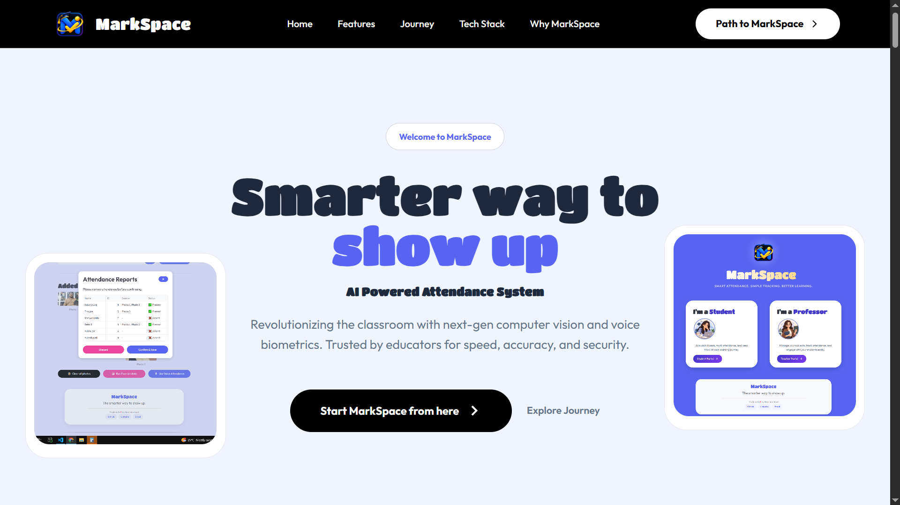

# MarkSpace - **The smarter way to show up.**

**[Visit Website](https:)** — one click away, with every tutorial and walkthrough you need before logging in.

## The problem

Walk into almost any classroom and the first fifteen to twenty-five minutes are gone before the actual class even begins. A teacher calls out names one by one, waits for a response, marks a register, and moves on to the next name. Multiply that across every class, every day, and it adds up to hours of teaching time lost every week — time that could have gone into actually teaching.

MarkSpace exists to take that dead time back.

## The idea

Instead of a teacher calling out names, she just takes a group photo of the class. That's it. MarkSpace runs the photo through a face recognition pipeline that identifies every registered student in the frame and marks them present against their individual student ID, in the correct subject and section. No roll call, no manual entry, no waiting.

For situations where a group photo isn't practical, students also have the option to check themselves in — a quick selfie is enough for the system to recognize them and mark their own attendance. And for cases where a photo isn't the right fit either, there's a voice-based recognition path as well, so attendance isn't locked into a single method.

### You might be thinking — biometrics are everywhere already, so why does MarkSpace even need to exist?

Biometric attendance (fingerprint or similar) is the obvious "smart" alternative people bring up, but it doesn't actually scale the way it sounds like it should. If you have a class of sixty students, you need sixty individual biometric scans, one after another, in a queue — which quietly brings back the exact same problem MarkSpace is trying to solve. A single group photo, on the other hand, captures everyone in the room at once. That's the whole advantage.

## How it works, in short

- **Registration**: Every student's face is registered once against their student ID.
- **Group capture**: A teacher takes a photo of the class at the start of a session and uploads it.
- **Recognition pipeline**: The ML pipeline detects and matches every face in the photo against the registered set, and marks each recognized student present for that specific class and subject.
- **Self check-in**: A student can alternatively mark their own presence with a photo of themselves.
- **Voice recognition**: An additional path for marking attendance using voice, for situations where a photo isn't the right method.

Each subject and section is tracked independently, so a student's attendance is always tied to the right class, not just a blanket "present for the day."

No manuals, no confusing setup for the end user — just snap a photo and you're done. It's meant to be super easy to use, whether you're a teacher taking the class photo or a student checking yourself in.

## Tech stack

- **Frontend**: Streamlit
- **Backend / Database**: Supabase
- **Face recognition**: dlib, face_recognition_models
- **Voice recognition**: Resemblyzer, Librosa
- **Data handling**: NumPy, Pandas, scikit-learn
- **Image processing**: Pillow
- **Security**: bcrypt for password hashing
- **QR codes**: Segno, for class/subject sharing codes

## License

This project is licensed under the GNU General Public License v3.0. See the `LICENSE` file for the full text.
